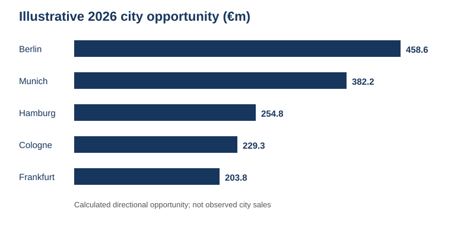
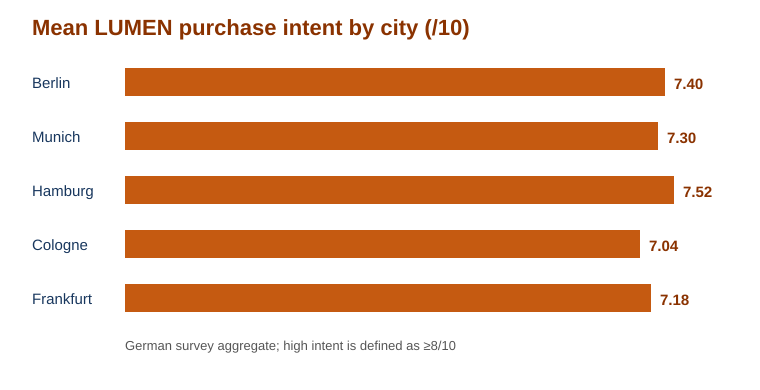

# LUMEN Germany — City comparison

Directional comparison for the first-city decision. All figures come from `data/market_context.csv` and anonymized aggregate calculations from `data/customer_survey.csv`.

## 1. Directional city scale

The bars below show the calculated 2026 Energy / focus opportunity. Berlin is the largest named-city opportunity in the supplied market split.



```mermaid
%%{init: {'themeVariables': {'xyChart': {'plotColorPalette': ['#1f4e79']}}}}%%
xychart-beta
    title "Illustrative 2026 city opportunity (€m)"
    x-axis [Berlin, Munich, Hamburg, Cologne, Frankfurt]
    y-axis "€m" 0 --> 500
    bar [458.6, 382.2, 254.8, 229.3, 203.8]
```



## 2. Customer evidence

```mermaid
%%{init: {'themeVariables': {'xyChart': {'plotColorPalette': ['#c55a11']}}}}%%
xychart-beta
    title "Mean LUMEN purchase intent (survey, /10)"
    x-axis [Berlin, Munich, Hamburg, Cologne, Frankfurt]
    y-axis "Intent" 0 --> 10
    bar [7.40, 7.30, 7.52, 7.04, 7.18]
```

**High-intent respondents (intent ≥8/10):** Berlin 44.4% (n=81), Munich 35.1% (n=57), Hamburg 45.8% (n=48), Cologne 44.4% (n=45), and Frankfurt 31.2% (n=32).

**Growth assumption:** Berlin and Munich are assigned 9% regional CAGR; Hamburg, Cologne, Frankfurt, and Other Germany are assigned 7% in `data/market_context.csv`.

\* Calculated as the city's illustrative share multiplied by the 2026 Energy / focus market value of **€2.548bn**. These are directional sizing metrics, not observed city sales or forecasts.

## 3. How to read the comparison

- **Berlin** leads on directional scale and has strong customer evidence, making it the recommended first pilot.
- **Hamburg** leads on mean intent, high-intent share, spend, and frequency among the five on some measures; it is the recommended challenger market.
- **Munich** combines scale and assumed growth with the highest purchase frequency, but its high-intent share is lower than Berlin and Hamburg.
- **Cologne** has a relatively strong high-intent share but lower mean intent, spend, frequency, and market size than Berlin, Munich, and Hamburg.
- **Frankfurt** has the highest mean spend but the smallest survey sample and lowest high-intent share among the five, so spend alone is insufficient to prioritize it.

### Why not Munich first?

Munich is a credible alternative: its illustrative opportunity is €382.2m, its assumed CAGR is 9%, and it has the highest purchase frequency at 6.38/month. Berlin is still preferred because its modeled opportunity is larger by €76.4m, its survey sample is larger (81 versus 57), and its high-intent share is higher (44.4% versus 35.1%). Munich should remain a priority for the next wave, not be dismissed.

## 4. Decision

Prioritize **Berlin** for the first controlled launch and use **Hamburg** as a comparison cell before scaling nationally. The comparison does not establish causal city performance: the market shares and CAGRs are illustrative inputs, and survey intent is not realized purchase behavior.

## 5. Scale decision: what to test

Use Berlin as the primary pilot and Hamburg as the challenger. Review weekly:

- rate of sale per active store;
- repeat purchase rate;
- DTC conversion and customer acquisition cost;
- net contribution after any promotion;
- difference in performance between Berlin and Hamburg.

Set the scale/no-scale thresholds before launch using LUMEN's economics and capacity plan. The supplied market and survey files do not contain reliable German sales or payback thresholds, so inventing pass/fail numbers here would be misleading.
